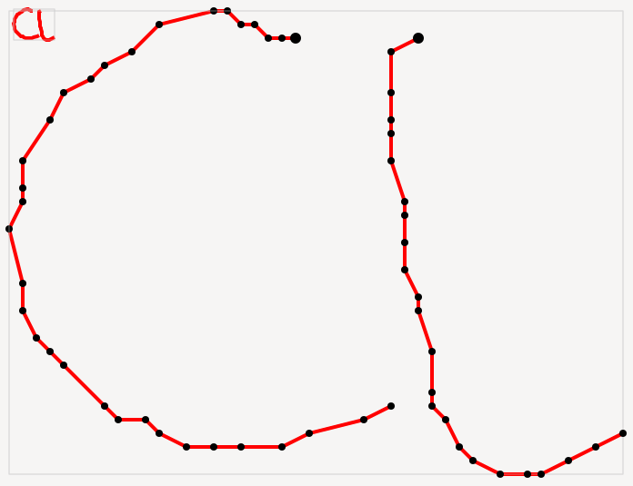
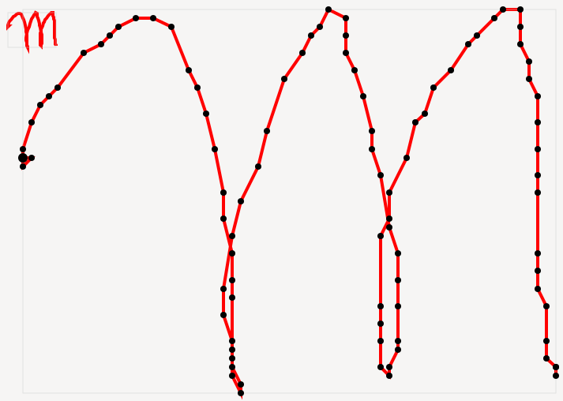
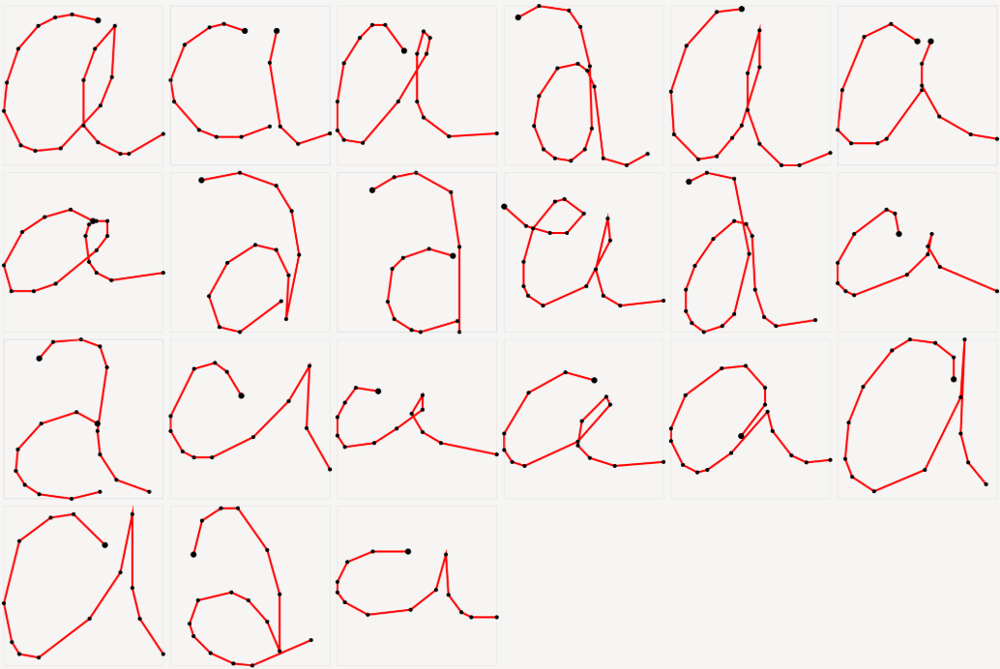

# Symbal-Latin
The Symbal-Latin engine is a generic technology for symbol and graphic gesture recognition developed at Orange Labs.

It is based on a detailed modeling of 2D gestures (letters, symbols, command gestures) using graphic primitives and employs an original probabilistic approach of causal generative type (i.e. segmental Hidden Markov Models where emission probability laws are linked to symbol structure).
Its distinctive feature is the ability to learn a new gesture very quickly from a very limited number of examples (typically between 3 and 10). This technology enabled the development of the Orange Gestures technology, which was available until 2021 on smartphones sold under the Orange brand.

Symbal-Latin thus allows the recognition of any type of symbol (composed of one or multiple strokes, especially a cursive letter) that has been previously learned, regardless of the size of the strokes. The system input is a tactile gesture (a temporal sequence of points) acquired via a touchscreen or touch panel. The system output is the recognized symbol (its label). Thanks to its API, it can be easily integrated into projects aiming to incorporate gesture-based interactions into their products.

See [Authors](#authors) section below for additional details.

Example of raw recorded sampling of an allograph for letter 'a' (data file: [a_001.unp](data-training/a_001.unp)), with two strokes:

NOTE : The _preprocessed_ version of the above allograph is shown as the second allograph of symbol 'a' [below](#symbol-drawing-examples).

# Used libraries and samples
Symbal-Latin uses C++ <code>gtkmm 4</code> (LGPL-2.1-or-later) [[↗]](https://gtkmm.gnome.org/) port of <code>gtk 4</code> with <code>cairo</code>(LGPL-2.1-or-later OR MPL-1.1) (i.e. <code>cairomm</code> [[↗]](https://www.cairographics.org/cairomm/) port) as its drawing framework. 
However, the recognition engine can be used and tested without building this [drawing](#drawing) capability. 
 
Symbal-Latin uses <code>doctest</code> (MIT) [[↗]](https://github.com/doctest) as its [test](#running-tests) framework. The test framework is already integrated in <code>./doctest</code> subdirectory of the project and does not require any extra download. 
 
Subdirectories <code>./data-training</code> and <code>./data-testing</code> are provided with data in _UNIPEX_ format for the [training](#usage-1---training) and [testing](#usage-2---testing) phases for convenience.

# Build _Symbal-Latin_

Symbal-Latin can be built on Windows, Linux and Mac OS. It was tested on Windows MSYS2 environment, Linux (via Windows WSL), and MAC OS.

## Create build directory (only once)
NOTE : This should be done from project directory, creating <code>build</code> as a subdirectory. 
<pre><code>mkdir build</code></pre>

## Create bin directory (only once)
NOTE : The <code>bin</code> directory allows binary output files to be stored in a separated directory (i.e. within <code>bin</code>). 
NOTE : Use of this directory at build time is ensured by the <code>Cmake</code> command <code>set(CMAKE_RUNTIME_OUTPUT_DIRECTORY ${CMAKE_SOURCE_DIR}/bin)</code> in main <code>./CMakeLists.txt</code> file. 
<pre><code>mkdir bin</code></pre>

## Generate build system from build directory
NOTE : The <code>cmake</code> command must be launched again each time any of the <code>CMakeLists.txt</code> files changes, or if the code file list changes (addition and/or deletion of files). 
NOTE : The underlying build system may be Ninja or other (here the default is used). 
NOTE : The resulting build files will reside within <code>build</code> directory. 
<pre><code>cd build
cmake ..
</code></pre>

### or, alternatively
NOTE : Use _one_ of the commands below. 
NOTE : The <code>cmake</code> command is executed from _project directory_ here (NOT from <code>build</code> subdirectory as above).
<pre><code>cmake -B build . -G Ninja
cmake -B build . -G Ninja -DCMAKE_BUILD_TYPE=Debug
</code></pre>

## Build _Symbal-Latin_ project
NOTE : Argument <code>--clean-first</code> may be added at the end.
<pre><code>cd build
cmake --build .
</code></pre>

## Build a specific target
NOTE :  Argument <code>--clean-first</code> is optional
<pre><code>cmake --build . --target=symbal-latin  --clean-first
cmake --build . --target=symbal-api    --clean-first
cmake --build . --target=symbal-engine --clean-first
</code></pre>

# Command usage

## Usage 1 - Training ([↑](#symbal-latin))
_Traning_ is the learning phase where the model is created from model traces (or collectively just 'trace').

NOTE : Model directory is written. 
NOTE : Short option format <code>-tr</code>, <code>-m</code> or long option format <code>--dir-trace</code>, <code>--dir-model</code> may be used indifferently, as shown below. 
NOTE : Equal signs <code>'='</code> below may be replaced with a space. 
<pre><code>./bin/symbal-latin --dir-trace=&lttrace directory&gt --dir-model=&ltmodel directory&gt
./bin/symbal-latin         -tr=&lttrace directory&gt          -m=&ltmodel directory&gt
</code></pre>

Example : 
<pre><code>./bin/symbal-latin -tr="./data-training/" -m="./symbols/"</code></pre>
NOTE : This command creates the <code>./symbol/</code> directory if needed. 
NOTE: On Windows, running <code>symbal-latin</code> might require the <code>.exe</code> extension as follows : <code>./bin/symbal-latin.exe</code>.

## Usage 2 - Testing ([↑](#symbal-latin))

Test of another trace (also called 'test trace') using the created model. 
Model traces from the training phase may also be used here for a model sanity check.

NOTE : Model directory is read-only in this usage. 
NOTE : No file is output in this usage. 
<pre><code>./bin/symbal-latin --dir-model=&ltmodel directory&gt --dir-test-trace=&lttest directory&gt
./bin/symbal-latin          -m=&ltmodel directory&gt               -t=&lttest directory&gt
</code></pre>

Example : 
<pre><code>./bin/symbal-latin -m="./symbols/" -t="./data-testing/"</code></pre>

## Usage 3 - Both Training and Testing

This is a combination of both above usages (model creation _and_ use on test trace). 

<pre><code>./bin/symbal-latin --tr=&lttrace directory&gt --m=&ltmodel directory&gt --t=&lttest directory&gt
</code></pre>

# Drawing ([↑](#symbal-latin))

## Trace drawing examples

A trace contains the raw recorded sampling of an allograph. The trace of 'm' below shows a recording artifact at stroke starting end.

NOTE: Option name <code>-trf</code> stands for _trace file_. The option long version is <code>--tracefile</code>. 
<pre><code>./bin/symbal-draw -trf="./data-training/a_001.unp"
./bin/symbal-draw -trf="./data-testing/a_a2c__11.unp"
</code></pre>

## Symbol drawing examples ([↑](#symbal-latin))

A symbol file is produced by the training phase and contains a set of preprocessed allograph samples, each with its corresponding prototype (or 'model').

Example visualisation of symbol file for letter 'a'. Only the preprocessed allograph samples are shown (not the prototypes). 
The preprocessing simplifies the raw traces and removes sampling artifacts, especially at stroke ends.

NOTE: Option name <code>-syf</code> stands for _symbol file_. The option long version is <code>--symbolfile</code>. 
<pre><code>./bin/symbal-draw -syf="./symbols/symbol_a.unpex"
./bin/symbal-draw -syf="./symbols/symbol_b.unpex"
</code></pre>

NOTE: On Windows, running <code>symbal-draw</code> might require the <code>.exe</code> extension as follows : <code>./bin/symbal-draw.exe</code>.

# Running tests ([↑](#symbal-latin))
Tests are implemented in the <code>./tests</code> subdirectory, using <code>doctest</code> version <code>2.4.12</code> integrated in <code>./doctest</code> subdirectory

<pre><code>./bin/bench-test --no-run             # run normal program only (not running tests)
./bin/bench-test --exit               # run tests then exit
./bin/bench-test                      # run tests then run program
./bin/bench-test --success            # print successful test cases
./bin/bench-test --version            # print doctest version
./bin/bench-test --help               # print help
</code></pre>

NOTE: On Windows, running <code>bench-test</code> might require the <code>.exe</code> extension as follows : <code>./bin/bench-test.exe</code>.

# License ([↑](#symbal-latin))

Copyright (C) 2004-2026 Orange

The Symbal-Latin software is distributed under the terms and conditions of the Massachusetts Institute of Technology (MIT) license, https://opensource.org/licenses/MIT

# Authors ([↑](#symbal-latin))
Symbal-Latin was developed by Eric Petit (Orange Research, Grenoble, France). 
The algorithm is partly the result of a research collaboration between Orange and LIP6, Paris 6 University (Marukatat, Artières & Gallinari, 2004),
with the support of Sylvie Vidal (Orange Research), who worked on the benchmarks and monitoring of the collaboration.

Our thanks to Aymeric de Solages (Orange Innovation) for having modernized the software code and having rebuilt the software project, as well as for the graphical display tools for traces.